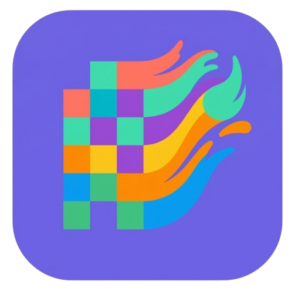

<div align="center">



# Pix2Paint

**Turn any image into a paint-by-numbers grid.**
Free. No sign-up. 100% in your browser.

[](./LICENSE)
[](https://www.typescriptlang.org/)
[](https://vitejs.dev/)
[](#privacy)

</div>

---

## What is it

Drop an image. Get a numbered grid ready to paint in real life. The whole pipeline runs locally in your browser - no upload, no server, no account.

Two flavors:

- **Pixel** - classic pixel grid, each cell numbered.
- **Smooth** - organic contour lines, like a real paint-by-numbers kit.

## Features

- **Color quantization** - up to 20 colors, tolerance slider to dial palette size.
- **Numbered regions** - per-cell or grouped per region.
- **Color legend** - hex codes, pixel counts, hover to highlight.
- **PNG export** - with numbers, grouped numbers, or none.
- **Auto-save** - resume your project on next visit (IndexedDB).
- **Zoom & pan** - scroll-zoom centered on cursor, drag-pan, elastic snap-back.
- **Web Worker** - heavy processing off the main thread.
- **Mobile-friendly** - sidebar collapses on small screens.

## Tech stack

| | |
|---|---|
| **Build** | Vite + TypeScript |
| **Rendering** | Canvas 2D |
| **Compute** | Web Worker (transferable buffers) |
| **Storage** | IndexedDB (raw API, no lib) |
| **UI** | Vanilla DOM, no framework |
| **Type** | Fredoka + Nunito (Google Fonts) |

Zero runtime dependencies beyond Vite tooling.

## Quick start

```bash
pnpm install
pnpm dev
```

Production build:

```bash
pnpm build
pnpm preview
```

## How it works

1. **Upload** - drag & drop or file picker.
2. **Pick a mode** - pixel grid or smooth contours.
3. **Quantize** - colors clustered to a target palette via Euclidean RGB distance.
4. **Detect regions** - BFS flood fill groups connected pixels.
5. **Render** - canvas paints cells/contours with optional numbers.
6. **Export** - PNG at 40px/cell (pixel) or up to 3000px (smooth).

## Privacy

No analytics. No tracking. No backend. Your images never leave your device.

## Documentation

| Doc | What's inside |
|---|---|
| [Architecture](docs/architecture.md) | Module structure, data flow, routing |
| [Rendering](docs/rendering.md) | Pixel and smooth pipelines, zoom/pan, snap-back |
| [Image Processing](docs/image-processing.md) | Quantization, BFS, contour tracing |
| [UI Components](docs/ui-components.md) | Component APIs, design system |
| [Persistence](docs/persistence.md) | IndexedDB storage, auto-save |

## License

[GPL-3.0](./LICENSE) - free to use, modify, and share.

---

<div align="center">
<sub>Made with care. Paint with joy.</sub>
</div>
